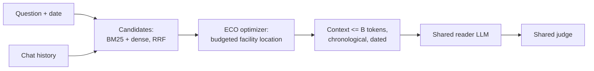

# ECO: context optimization under a token budget

Long-term chat assistants cannot put a user's whole history in the prompt. Given the history and a budget of
**B** tokens, a context optimizer decides what the reader model gets to see. This repo tests one idea,
**ECO**, against two recent memory systems, **ReFind** and **MemoryCPT**, and standard retrieval baselines on
[LongMemEval-S](https://github.com/xiaowu0162/LongMemEval). Every system gets the same reader, judge and
tokenizer, and the final context is asserted to be at most B tokens.

## The idea

Top-k retrieval fills the budget with the highest-scoring turns, which are often near-duplicates of each other.
ECO treats context building as **budgeted coverage**: choose the set of turns that best *covers* everything
relevant to the question, so each token of budget adds information the reader does not already have.

```
maximize   F(S) = sum over candidates i of  r(i) * max over m in S of  sim(i, m) * fid(m)
subject to sum over m in S of cost(m) <= B
```

- `r(i)`: relevance of turn i to the question (BM25 and dense rankings fused with RRF)
- `sim(i, m)`: embedding similarity, i.e. how well chosen turn m stands in for turn i
- `fid(m)`: fidelity of the rendering (1.0 for a raw turn, lower for a compressed fact)
- `cost(m)`: tokens

F is monotone submodular, so a lazy cost-benefit greedy (CELF) plus a best-single-item check gives a
constant-factor approximation guarantee.

## The flow



How the compared systems spend their effort:

| | ECO | ReFind (reimpl.) | MemoryCPT-lite (reimpl.) |
|---|---|---|---|
| Build time | index turns (no LLM) | none | LLM builds episodic + semantic memory |
| Query time | one optimization, no LLM | ReAct agent searches and takes notes | retrieval + LLM query-aware summary |
| Reader sees | raw turns chosen for coverage | collected notes, cut to B | summary (<= 512 tokens) |

## Results (pilot)

<!-- results:start -->
QA accuracy on 12 stratified dev questions, oracle view, reader and judge `gpt-oss-20b` (95% bootstrap CI). Source: `results/tables/20260930-001519_compare_dev_oracle_qa_summary.csv`.

| System | Accuracy, B=500 | Accuracy, B=1000 | Reader context tokens (B=1000) | LLM build tokens / question | LLM query-time tokens / query |
|---|---|---|---|---|---|
| ECO (ours) | 7/12 (0.25-0.83) | 8/12 (0.33-0.92) | 882 | 0 | 0 |
| MemoryCPT-lite (reimpl.) | 6/12 (0.25-0.75) | 7/12 (0.33-0.83) | 124 | 11,610 | 2,642 |
| ReFind (reimpl.) | 0/12 (0.00-0.00) | 0/12 (0.00-0.00) | 11 | 0 | 85,150 |

Reference, same run: the oracle (all gold evidence turns first) scores 8/12 at B=500, 8/12 at B=1000, so the reader caps accuracy on this sample. Token columns count LLM calls only (embeddings run locally and are listed separately in the CSV); judge calls are excluded.
<!-- results:end -->

What the pilot shows so far:
- ECO matches or beats MemoryCPT-lite here while making no LLM calls at build or query time.
- In recall-only runs, ECO keeps the most evidence at larger budgets but is the weakest selector at the smallest
  budgets, where cost-benefit greedy favors short, generic turns. Fixing this is the next step.
- ReFind (reimpl.) scores 0 because its search agent never saves notes with `gpt-oss-20b`; this is a failure of the
  agent with this model, not evidence about the method.
- Twelve questions is a pilot: the confidence intervals overlap. Full dev and test runs come next.

## Systems

| Key | System | LLM calls |
|---|---|---|
| `recent` | most recent turns that fit | none |
| `bm25`, `dense`, `hybrid` | top-k by BM25, embeddings, or both fused with RRF | none (embeddings for dense/hybrid) |
| `mmr` | maximal marginal relevance, lambda 0.7 | none |
| `eco` | facility-location selection over raw turns (`systems/eco/select.py`) | none |
| `eco_facts` | `eco` + LLM-extracted facts as retrieval keys and cheaper renderings | construction |
| `memorycpt` | MemoryCPT-lite (reimpl.): memory store + query-aware summary | construction + query |
| `refind` | ReFind (reimpl.): ReAct search agent that collects notes | query |
| `oracle` | gold evidence turns first (upper bound) | none |

Reimplementations are simplified: no released code or checkpoints exist for either paper.

## Setup

Requires Python 3.11, [uv](https://docs.astral.sh/uv/) and [Ollama](https://ollama.com) for embeddings.

```bash
uv sync
cp .env.example .env                  # add your keys
ollama serve && ollama pull nomic-embed-text
```

Models are defined in `model.py` (`LLM_POOL`, `JUDGE_LLM`, `EMBEDDINGS`); every call goes through
`core.llm.client` with a SQLite cache (`.cache/`) and per-stage cost logging.

Data: download the cleaned LongMemEval files into `dataset/` (not committed), then freeze the split once:

```bash
uv run python scripts/prepare_data.py
```

## Run

```bash
# Tier 1: evidence recall per budget, no reader/judge calls (dev split, oracle view)
uv run python scripts/run_compare.py

# Tier 2: QA accuracy with the shared reader and judge
uv run python scripts/run_compare.py compare.eval=qa "compare.systems=[bm25,mmr,eco,memorycpt,oracle]"

# Pilot on a stratified sample
uv run python scripts/run_compare.py compare.n_questions=12
```

Settings live in `configs/compare.yaml`; any field can be overridden as `a.b=value`. Every run writes
`results/runs/<run_id>/` (resolved config, git commit, predictions, costs, traces; not committed) and two tables:
`results/tables/<run_id>_summary.csv` (system x budget) and `results/tables/<run_id>.csv` (by question type,
with 95% bootstrap CIs). Tables are generated only from logged runs.

## Evaluation protocol

- **Split:** 100 dev / 400 test, stratified by question type, frozen in `configs/splits/`. Everything is fit on
  dev; test is run once for the final report.
- **View:** `oracle` (evidence sessions only, median ~5.7K tokens) isolates selection from search; `full` uses
  the whole ~115K-token haystack.
- **Metrics:** `verbatim_recall` (share of gold evidence turns whose raw text reaches the reader),
  `evidence_recall` (also counts turns cited by a derived fact or summary), QA accuracy (LongMemEval judge
  prompt), and construction / query-time tokens per question (judge excluded).

## Repository layout

```
model.py            model definitions (keys come from .env)
configs/            base.yaml, compare.yaml, splits/
core/               shared plumbing: data + views, llm client/cache/cost, retrieval, eval, runner
systems/            one package per system: baselines/, eco/, refind/, memorycpt/
scripts/            run_compare.py, make_table.py, readme_results.py, prepare_data.py, list_models.py
tests/              pytest suite (no network or paid LLM calls)
results/tables/     generated CSVs
```

Add a system: create `systems/<name>/`, implement `build_memory(q)` and
`build_context(query, memory, token_budget, query_date) -> ContextResult`, and register it in
`systems/__init__.py`.

## Tests

```bash
uv run pytest -q
```

## References

- LongMemEval: Wu et al., *Benchmarking Chat Assistants on Long-Term Interactive Memory*, 2024.
- ReFind: arXiv 2608.12888.
- MemoryCPT: arXiv 2608.04843.
